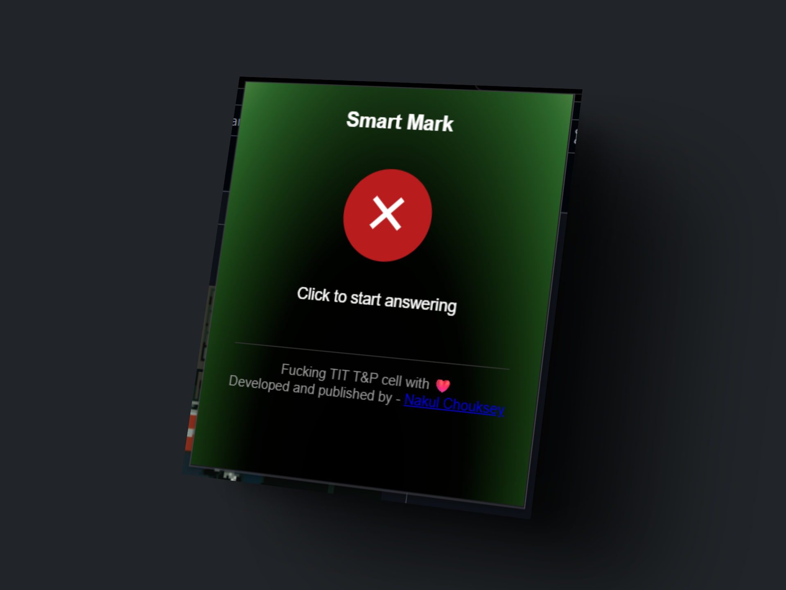
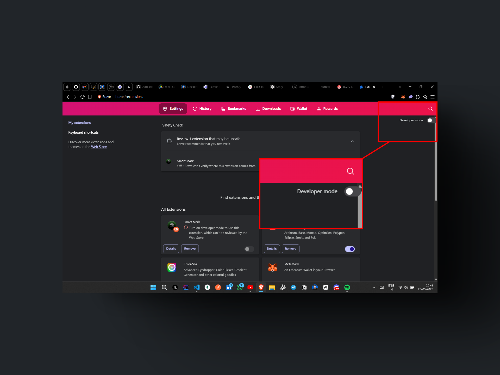
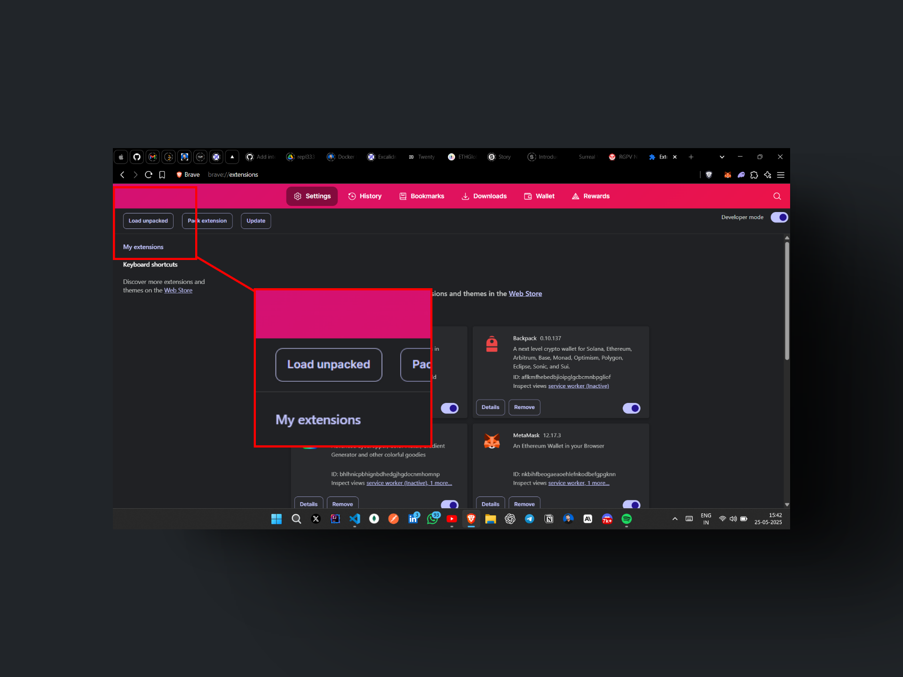
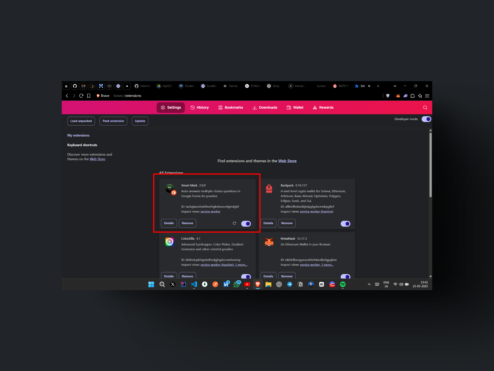
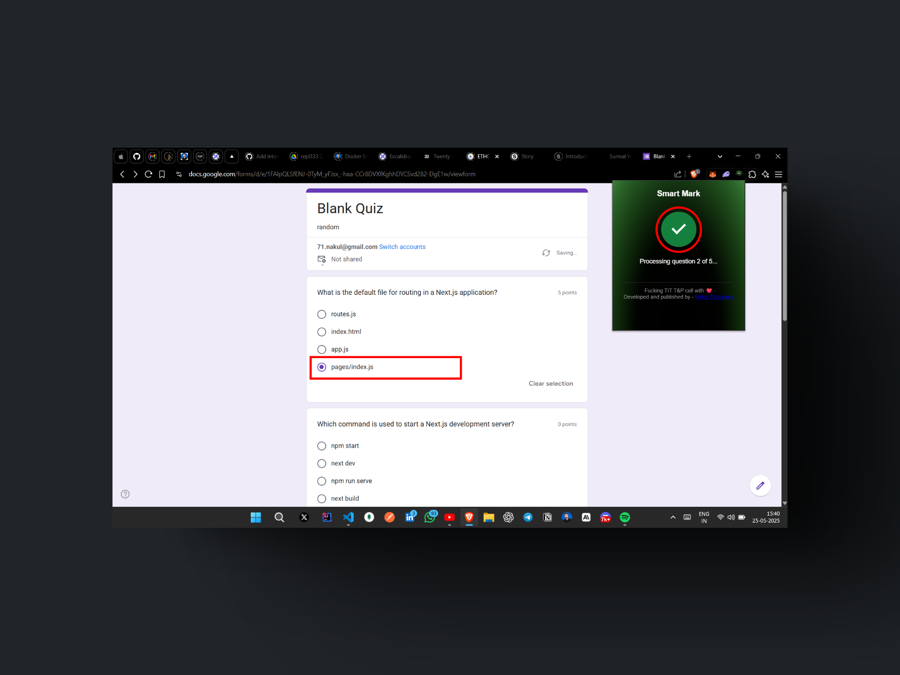

# 🚀 Smart Mark

**Smart Mark** is a browser extension that uses the Gemini API to automatically search and mark correct answers in quiz forms like Google Forms.

---

## ✨ Features

- 🔍 Uses Gemini AI to find accurate answers.
- ✅ Auto-selects correct options in forms.
- 🧠 Works in real time.
- 🎯 Lightweight and efficient.
- 🛡️ No data stored or tracked.

---

## 📸 Screenshots

1. **Landing Page of Smart Mark Extension**  
   

2. **Enable Developer Mode**  
   Pointing to the **Developer mode** toggle in the browser.  
   

3. **Click on "Load Unpacked"**  
   Pointing to the **Load unpacked** button.  
   

4. **Extension Loaded Successfully**  
   Showing the Smart Mark extension visible in `brave://extensions`.  
   

5. **Start Auto Answering**  
   Pointing to the Smart Mark button and the automatically selected answer option.  
   

---

## 🔧 How It Works

1. Detects multiple-choice questions from quiz forms.
2. Sends question text to Gemini API.
3. Parses response and identifies the correct answer.
4. Automatically selects the right option on the form.

---

## 🛠️ Installation

1. Clone this repo or [Download ZIP](https://github.com/naaakul/Smart-Mark/archive/refs/heads/master.zip)
2. Go to `chrome://extensions/` in your browser.
3. Enable **Developer Mode**.
4. Click on **Load unpacked** and select the `smart-mark` folder.

---

## 🧪 Tech Stack

- JavaScript
- Gemini API
- HTML/CSS
- Chrome Extension API

---
